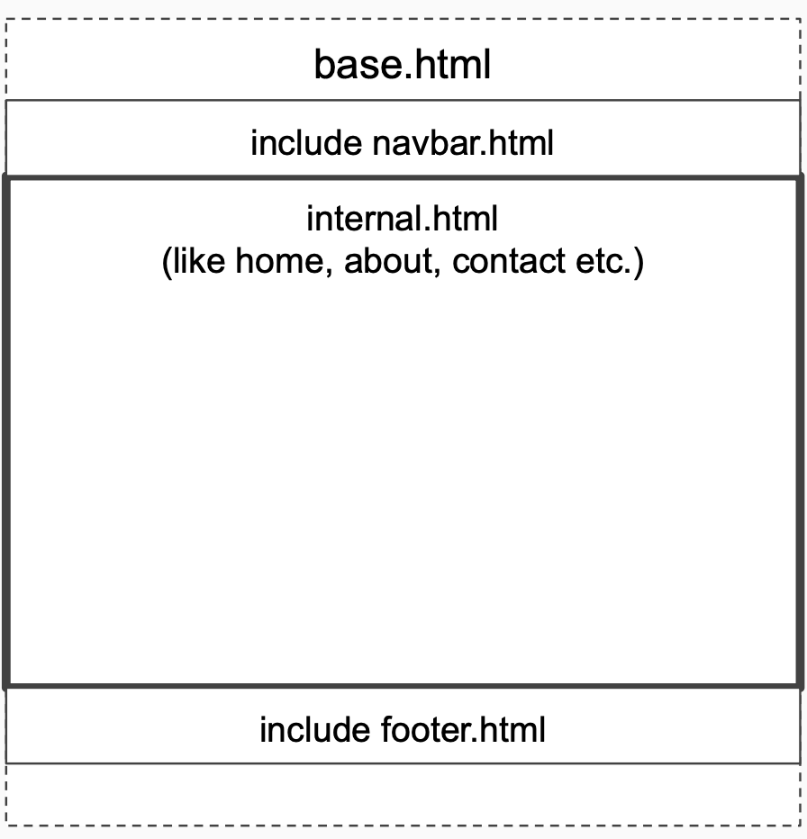

# JBD Django :atom:

Aşağıdakı tapşırıqları həll etməyinizi tələb edirik. Əvvəlcə tələbləri oxumağı unutmayın.
#### Tapşırıqları həll etmək üçün bilməli olduğunuz mövzular :brain:

* Django proyektin yaradılması
* Django app-lərin yaradılması
* Django fayl strukturu
* Views, Url mapping, Template systems, Template inheritance, Static files

**Qeydlər**: :pushpin:
* Tapşırıqları vaxtında həll etməyi və göndərməyi unutmayın :hourglass_flowing_sand:
### Tapşırıqlar :dart:

* `food_stories` adlı django layihə yaradın
* `stories` adlı app yaradın
* [stories](./stories) folderindəki front-end fayllarından istifadə edərək static faylları konfiqurasiya edin
* `Home`, `About`, `Stories`, `Recipes` və `Contact` səhifələrinin template-lərini qaytaran sadə django view-ları yaradın
* Yaratdığınız view-lara uyğun url-lar yaradın
* Hər bir template üçün (images, css, js, fonts) konfiqurasiya edin
* Aşağıda verilmiş sxemi bütün template-lərə tətbiq edin 
* `About` səhifəsinin kontentini (title, description texts, list which consist of daily visitors, stories, recipes and user’s count) context olaraq göndərin.
* Kateqoriya siyahısı yaradıb ( for example: [Fruits, Vegetables, Protein, Dairy]) footer-də istifadə edin. 
    - ***Hint*** :lollipop:  Templatetags-dən istifadə edin.

**Powered by [TechAcademy](https://www.tech.edu.az/)**
